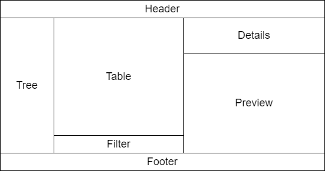

# myfe

[](https://app.travis-ci.com/alexengrig/myfe)

MYFE (MYFE Youth File Explorer) is a file explorer application.


## Build

Required Gradle and JDK 11.

```shell
# build
gradle shadowJar
# run
java -jar build/libs/myfe.jar
```

## Architecture

```
        User
          \ action
           v             update
        UI delegate -----------> MODEL
      (VIEW + CONTROLLER) <-------
          ^    \           notify
           \    v
           SERVICE
            ^   / query
    result /   v
        REPOSITORY
          ^    \
           \    v
          Data Store
```

## UI

### Window


### Tab



## License

This project is [licensed](LICENSE) under [Apache License, version 2.0](https://www.apache.org/licenses/LICENSE-2.0).
